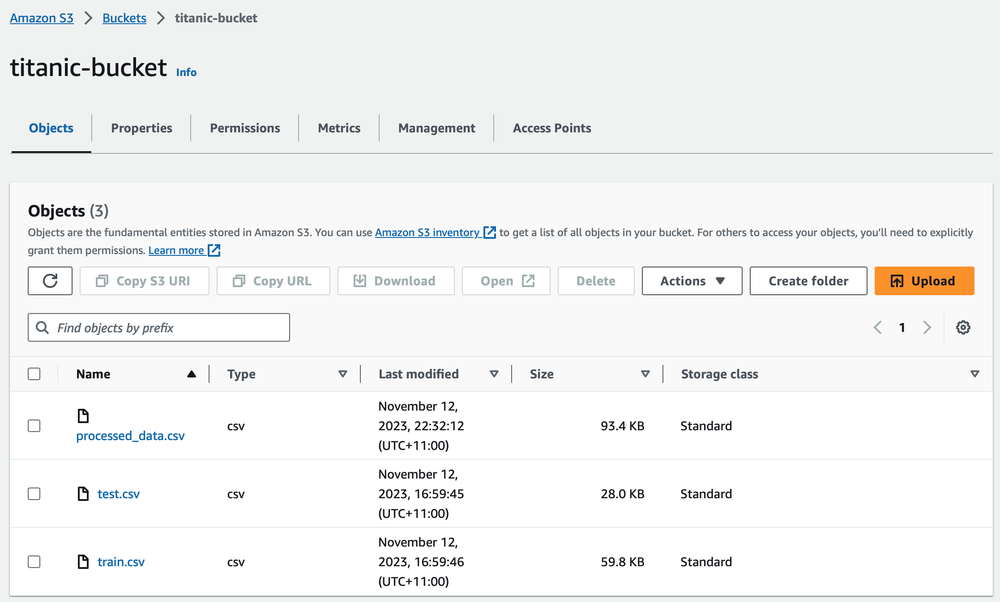
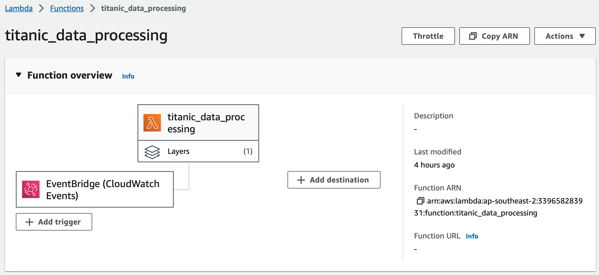

# AWS Lambda Data Processing Project

## Overview

This project demonstrates a minimal data processing pipeline implemented on AWS Lambda using the Titanic: Machine Learning from Disaster dataset. The pipeline is designed to run a data processing function daily to handle the dataset stored in an S3 bucket.

## Features

The data processing pipeline consists of the following steps:

1. The dataset is updated to the S3 bucket (`titanic-bucket`).
2. Once a day, the data processing function (`titanic_data_processing`) is triggered by Lambda.
3. The processed dataset is saved to the S3 bucket (`titanic-bucket`) as `processed_data.csv`.

## Snapshots

#### `titanic-bucket` in S3 Bucket

> 

#### Data processing function in Lambda

> 

## Steps conducted

1. **S3 Bucket and Dataset:**

   - Create an S3 bucket (e.g., `titanic-bucket`) and upload the Titanic dataset (CSV format).
   - Dataset Link: [Titanic: Machine Learning from Disaster](https://www.kaggle.com/c/titanic/data)

2. **Lambda Function:**

   - Create an AWS Lambda function to process the dataset.
   - Set up a trigger using EventBridge to run the function daily.
   - Attach the `AWSSDKPandas-Python311` layer to the Lambda function for Pandas support.

3. **Lambda Function Code:**

   - Use the provided Python code snippet for the Lambda function. This code reads and processes the Titanic dataset from S3, handles missing values, encodes categorical variables, and creates new features.

     ```python
     import pandas as pd
     import boto3
     from io import StringIO

     def lambda_handler(event, context):
         # Connect to S3
         s3 = boto3.client('s3')

         # Specify your S3 bucket and file names
         bucket_name = 'titanic-bucket'
         train_file_name = 'train.csv'
         test_file_name = 'test.csv'

         # Function to read CSV from S3
         def read_csv_from_s3(file_key):
             response = s3.get_object(Bucket=bucket_name, Key=file_key)
             csv_content = response['Body'].read().decode('utf-8')
             return pd.read_csv(StringIO(csv_content))

         # Load train and test datasets
         train_data = read_csv_from_s3(train_file_name)
         test_data = read_csv_from_s3(test_file_name)

         # Combine train and test datasets for processing (if needed)
         titanic_data = pd.concat([train_data, test_data], ignore_index=True)

         # Fill missing ages with the mean age)
         titanic_data['Age'].fillna(titanic_data['Age'].mean(), inplace=True)

         # Encode categorical variables (convert 'Sex' to numeric)
         titanic_data['Sex'] = titanic_data['Sex'].map({'male': 0, 'female': 1})

         # Create new feature: 'FamilySize' =  'SibSp' + 'Parch')
         titanic_data['FamilySize'] = titanic_data['SibSp'] + titanic_data['Parch'] + 1

         # Display the first few rows of the transformed dataset
         print(titanic_data.head())

         # Write the combined dataset back to S3
         s3.put_object(Body=titanic_data.to_csv(index=False), Bucket=bucket_name, Key='processed_data.csv')

         return {
             'statusCode': 200,
             'body': 'Data processing successful!'
         }
     ```

   - Ensure that the Lambda execution role has sufficient permissions for S3 and Lambda.

4. Deploy the Lambda function with the configured trigger and necessary permissions.
